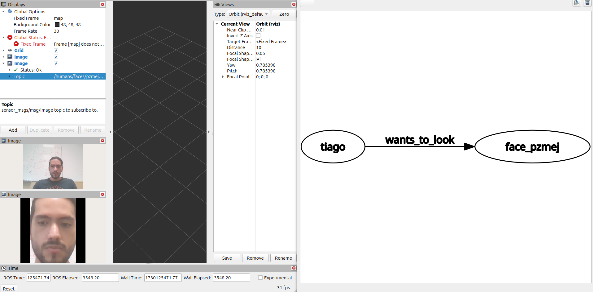

# My ROS2 Package

This ROS 2 package leverages third-party dependencies, which are managed via a `thirdparty.repos` file. Additionally, a Python virtual environment named `py_deps` is required for managing Python dependencies and allowing access to system packages.

## Setup Instructions

Follow these steps to configure and build this package:

### 1. Clone and Import Third-Party Repositories

Ensure that the third-party dependencies are cloned into the `thirdparty` directory. Use the `thirdparty.repos` file to handle this:

```bash
mkdir -p my_workspace/src
cd my_workspace/src
git clone https://github.com/CoreSenseEU/cs4home_examples
vcs import < thirdparty.repos
```

### 2. Create and Configure the Python Virtual Environment

A virtual environment named `py_deps` is required. This environment will include system packages as well as specific third-party dependencies.

#### Steps:

1. **Create the virtual environment** with access to system packages:

   ```bash
   python3 -m venv --system-site-packages py_deps
    ```

2. **Activate the virtual environment:**

   ```bash
    source py_deps/bin/activate
    ```


3. **Install the required packages in py_deps:**

   ```bash
    pip install -r thirdparty/hri_face_detect/requirements.txt
    pip install -r thirdparty/yolov8_ros/requirements.txt
    ```

4. **Add custom PYTHONPATH to the activate script:**

    Edit py_deps/bin/activate to add the following line:
     ```bash
    export PYTHONPATH="${PYTHONPATH}:/path_to_your_venv_packages"
    ```
    Replace /path_to_your_venv_packages with the absolute path to your desired directory for custom Python packages.


### 3. Build the Package

With dependencies and environment set up, you can build your ROS 2 package:

```bash
colcon build --symlink-install
```
### 4. Running the face example 

The face example node is a simple implementation in which you convert a hri_msgs/msg/IdList from hri_face_detect package to a knowledge graph representation.

After building, source the environment and activate the virtual environment you can ron the example as:

```bash
source install/setup.bash
source py_deps/bin/activate
```
run [hri_face example](https://github.com/ros4hri/hri_face_detect?tab=readme-ov-file#example), then execute the node

```bash
ros2 launch coresense cs4home_simple_project face_example.launch.py
```
finally if you want to visualize the output graph you can 
```bash
rqt --force-discover 
```
then navigate to knowledge_graph plugin

if everything went ok you will see something like this:


